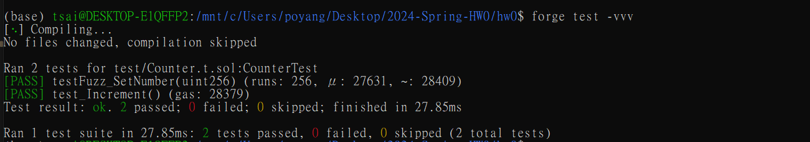
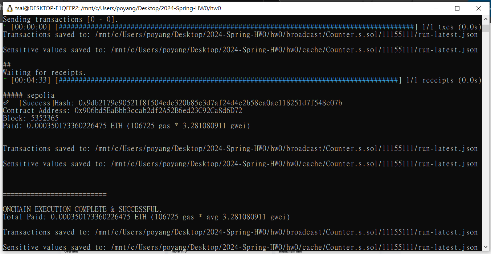
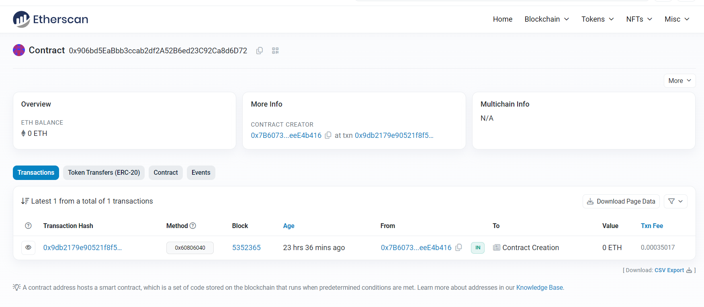

# 2024-Spring-HW0

All the detailed specified in Homework 0 documentation.

## Wallet Address
Please provide your MetaMask wallet address:
0x7b6073e54b1d6ce6ab80253c30a1b2eeeee4b416

## Local Testing
Please provide a screenshot of the `forge test -vvv` command running in your local environment.

## Contract Address
Please provide the contract address that you deployed on the Sepolia network.
0x906bd5EaBbb3ccab2df2A52B6ed23C92Ca8d6D72

## Sepolia Etherscan
Paste the contract address into the Sepolia Etherscan and share the screenshot.
